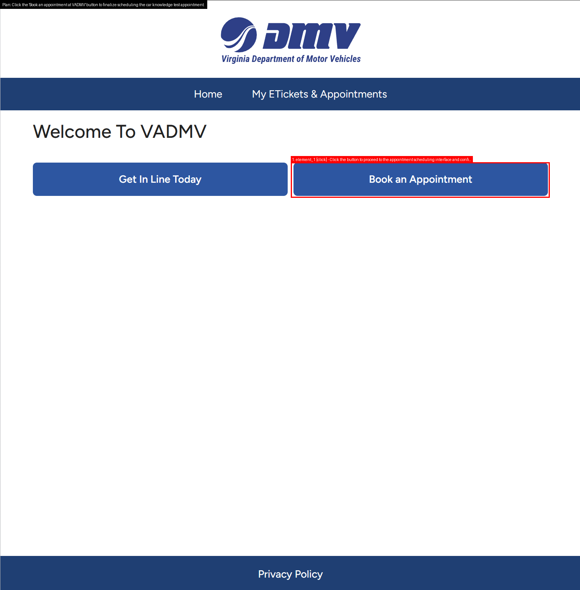
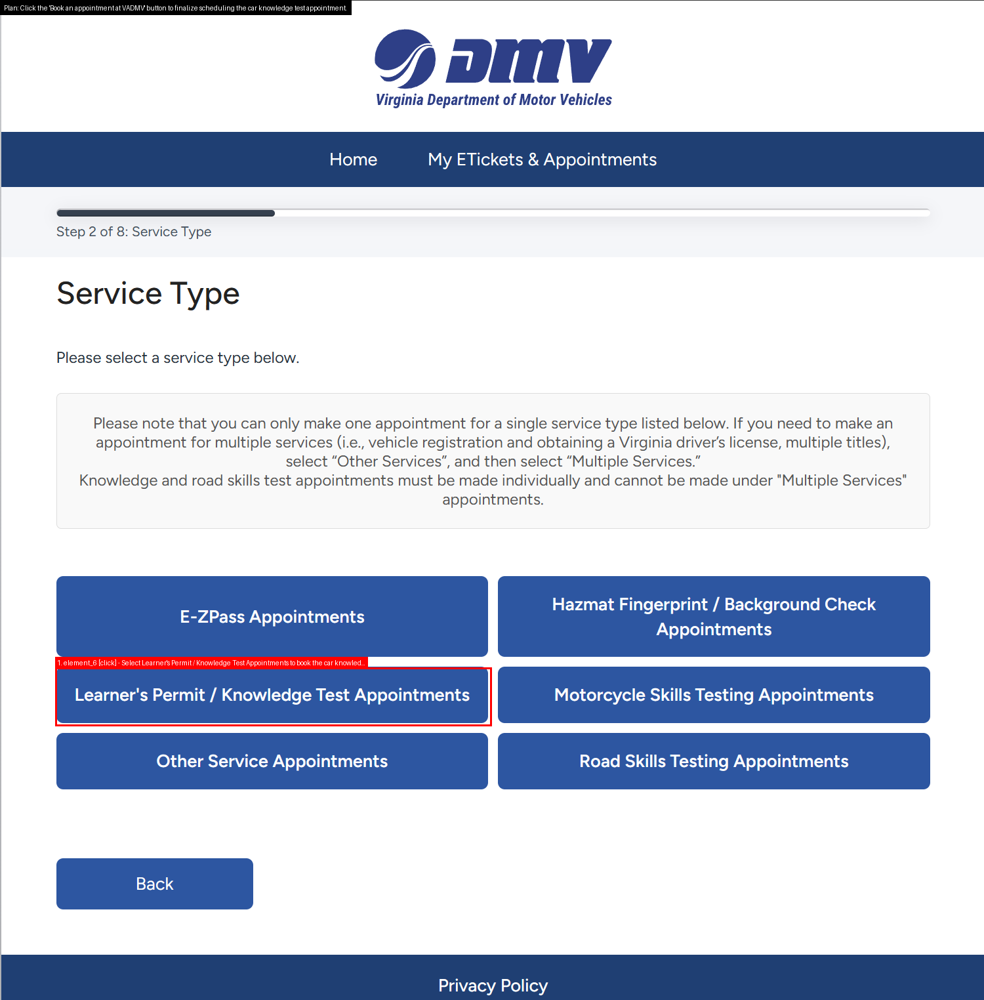

# Digital World Agent: Robust Screen Understanding & Decision Pipeline

This project is a prototype Digital World Agent. It takes a raw UI screenshot and produces structured representations of the screen, reasoning traces, and task-oriented decisions. The goal is to bridge perception and reasoning for robust UI automation.

---

 

## General Thought about Digital World Understanding

To enable a system to “understand the digital world like humans,” it must jointly model the local (what each element looks like, its attributes, and affordances) and the global/relational aspects (semantic, spatial, and functional relationships among elements and their relevance to the task goal), and integrate them into a unified representation for reasoning, planning, and acting—simply recognizing individual elements is not enough. This project is a start of a possible experimental implementation. 

## Features

- UI parsing: YOLO/OmniParser element detection + hybrid OCR (Tesseract/EasyOCR/TrOCR/PaddleOCR).
- VLM analysis: page summary and high‑confidence affordances/actions for downstream use.
- Planning agent: history‑aware, updates prior plan, assumes earlier steps done; outputs plan/steps/success_criteria; renders thinking_actions overlay.
- Decision agent: selects next element+action with safety rules; avoids repeats via actions_history; robust fallbacks when uncertain.
- Session runner: interactive multi‑step flow, thinking‑only mode, per‑step artifacts, auto‑append previous step’s planned steps to actions_history, resume script to index steps.
- Configurable models: switch weights/IDs via env; GPU/CPU friendly; tunable thresholds.
- Rich outputs: JSON and annotated images for understanding, actions, thinking, and decisions.

---

## Same Page Demo

- Task: `find flights from boston to la on 2025/10/5 and back on 2025/10/8`
- Session folder: `pipeline_outputs/sessions/session_20250924_151105`
- Preview (Step 1 actions):


- Thinking excerpt (`step_1_thinking.json`):

```json
{
  "plan": "Set departure and destination, choose round-trip, enter travel dates, and search for flights.",
  "steps": [
    {"element_id": "element_6", "actions": ["click","type"], "details": "Enter departure location as Boston"},
    {"element_id": "element_5", "actions": ["click","type"], "details": "Enter destination as Los Angeles"},
    {"element_id": "element_11", "actions": ["click"], "details": "Select round-trip travel option"},
    {"element_id": "element_0", "actions": ["click","type"], "details": "Open dates picker and enter departure date 2025/10/5"},
    {"element_id": "element_0", "actions": ["type"], "details": "Enter return date 2025/10/8"},
    {"element_id": "element_2", "actions": ["click"], "details": "Initiate flight search"}
  ]
}
```

- More outputs (JSON, images) are available in `pipeline_outputs/sessions/session_20250924_151105`.

- Note: The outputs are not just raw model results. Each step involves custom prompting strategies and additional algorithms to refine element selection, enforce task constraints, and ensure robustness.
---

## Cross Page Demo

- Task: `schedule an appointment for car knowledge test.`
- Session folder: `pipeline_outputs/sessions/session_20250925_165550`
- Preview (per‑step thinking actions):

Step 1


Step 2



Step 3



More outputs (JSON, images) are available under the same session directory.

---

## Installation
Prereqs: Python 3.9, Conda. GPU strongly recommended.

```bash
conda env create -f environment.yml
conda activate screen-understanding
```

Place YOLO weights at:
```
weights/icon_detect/model.pt
```

---

## Quickstart (Sessions)

- All platforms:
  - Run: `python session_cli.py`
  - Enter your task when prompted. The tool creates `pipeline_outputs/sessions/session_YYYYMMDD_HHMMSS/`.
  - Drop screenshots named `1.png`, `2.png`, ... into that session folder and press Enter to advance.

- Optional env vars:
  - `DECIDER_MODEL`: decision model id (default `openai/gpt-oss-20b`).

- Linux/macOS (bash):
```bash
export DECIDER_MODEL=openai/gpt-oss-20b
python session_cli.py
```

- Windows PowerShell:
```powershell
$env:DECIDER_MODEL = "openai/gpt-oss-20b"
python session_cli.py
```

- Alternative: one-off image
  - To run the pipeline once on a single image:
```bash
export IMAGE_PATH=examples/united_sample.png
python pipeline.py
```

---

## Outputs
Primary (session) outputs are saved under `pipeline_outputs/sessions/session_YYYYMMDD_HHMMSS/step_N/`:
- `step_N_input.png`
- `step_N_screen_understanding.json`
- `step_N_element_actions.png` (if available)
- `step_N_thinking.json`
- `step_N_thinking_actions.png`

Session root also contains:
- `task.txt`
- `actions_history.json`
- `thinking_latest.txt`

Alternative (one-off image via `pipeline.py`) writes under `pipeline_outputs/`:
- `<image>_screen_understanding_output.json`
- `<image>_element_actions.png`
- `<image>_decision.json` (when `DW`/`DW_TASK` is set)

---

## Why This Matters
This pipeline is a first step towards robust Digital World AI agents:
- Perception + Reasoning + Action Selection
- Extensible to real automation (Playwright / Appium adapters)

It is designed to be:
- Research-friendly (swap models, log outputs)
- Explainable (stores reasoning traces)
- Agent-ready (outputs can plug into executors for automation)

---

## Limitations & Future Work
- Current element detection (OmniParser) has limited coverage on diverse UIs
- VLM struggles with fine-grained text-element alignment
- LLM reasoning requires fine-tuning for robustness
- Next step: improve better cross-modal alignment (understand actionable elements with its parent structure and parent's parent structure until the whole page)
- Transfer page info with actions and elements into sequence representaion, send to nn, output actions and updated the network. Save them into hidden state/cache. Then reinput new page with cache until output 'end signal'.
- reinforce learning 

---

## License
MIT. See `LICENSE`.

Third-party components retain their own licenses:
- Detector weights/config under `weights/icon_detect/`: see `weights/icon_detect/LICENSE`
- VLM (e.g., `Qwen/Qwen2.5-VL`): Qwen Model License (Alibaba)
- Decision model (e.g., `openai/gpt-oss-20b`): see model card/license
- OCR (PaddleOCR/PaddlePaddle): Apache-2.0
